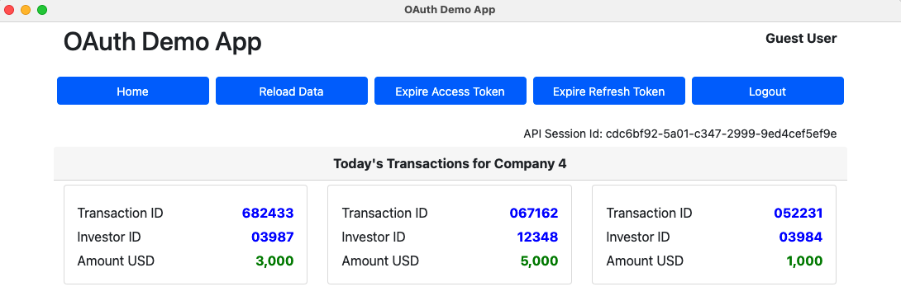

# Initial OAuth Desktop App

[](https://app.codacy.com/gh/gary-archer/oauth.desktopsample1?utm_source=github.com&utm_medium=referral&utm_content=gary-archer/oauth.desktopsample1&utm_campaign=Badge_Grade)

[](https://snyk.io/test/github/gary-archer/oauth.desktopsample1?targetFile=package.json)

## Overview

* The initial OpenID Connect desktop code sample
* **The goal is to implement OpenID Connect in a desktop app with good usability and reliability**

## Views

The desktop app is a simple UI with some basic navigation between views, to render fictional resources.\
The data is returned from an API that authorizes access to resources using domain specific claims.



## Local Development Quick Start

First ensure that Node.js 20+ is installed.\
Then build and run the app via this command, which will trigger the OpenID Connect desktop flow:

```bash
./start.sh
```

A login is triggered in the system browser, so that the app cannot access the user's credentials.\
A lookback redirect URI runs on the local computer to receive the login response. 


You can login to the desktop app using my AWS Cognito test account.\
You can then test logins, API calls and token renewal:

```text
- User: guestuser@example.com
- Password: GuestPassword1
```

## Further Information

- Further architecture details are described starting in the [Initial Desktop Sample Overview](https://apisandclients.com/posts/desktop-apps-overview).
- See the [Final Desktop Sample](https://github.com/gary-archer/oauth.desktopsample.final) for a more complete code sample.

## Programming Languages

* Electron and TypeScript are to implement the Desktop App

## Infrastructure

* The [AppAuth-JS](https://github.com/openid/AppAuth-JS/blob/master/README.md) library is used to implement the Authorization Code Flow (PKCE)
* [AWS Serverless](https://github.com/gary-archer/oauth.apisample.serverless) or Kubernetes is used to host remote API endpoints used by the app
* AWS Cognito is used as the default Authorization Server for the UI and API
